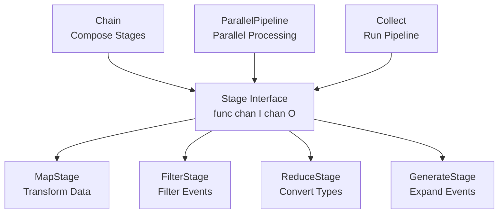
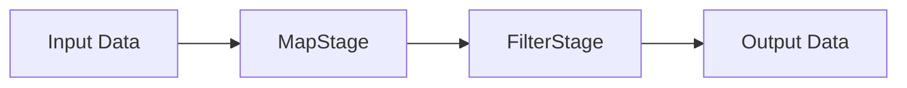
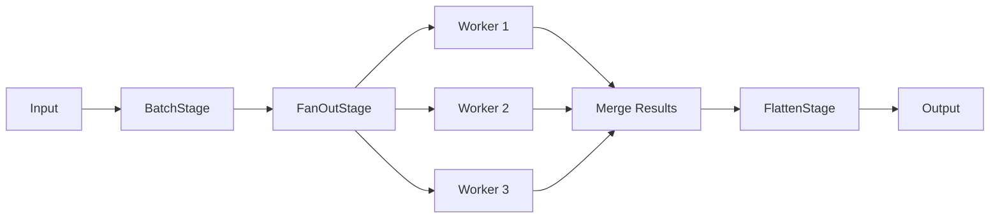
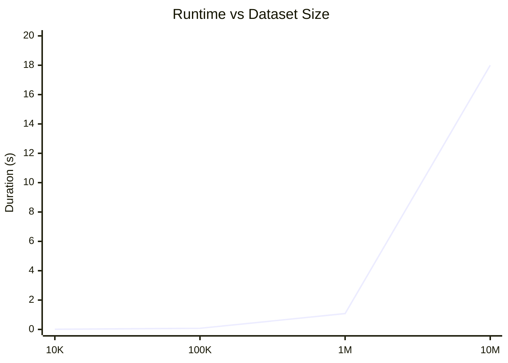
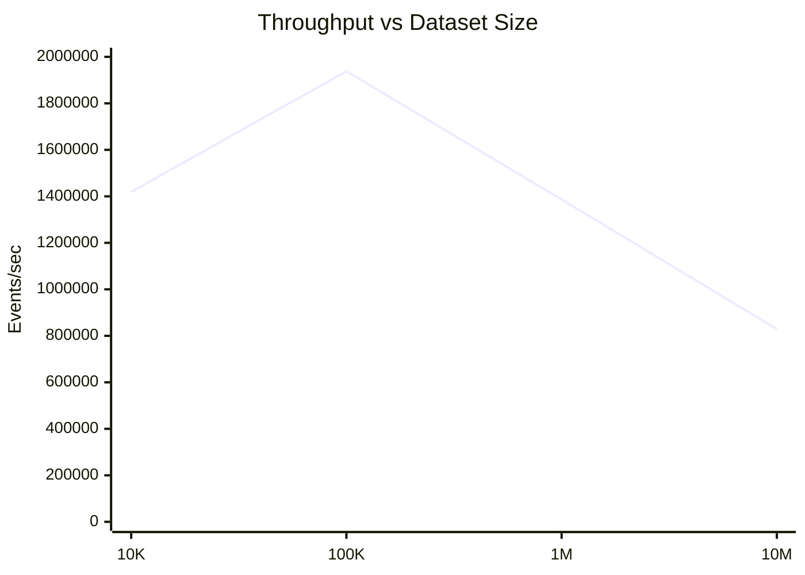
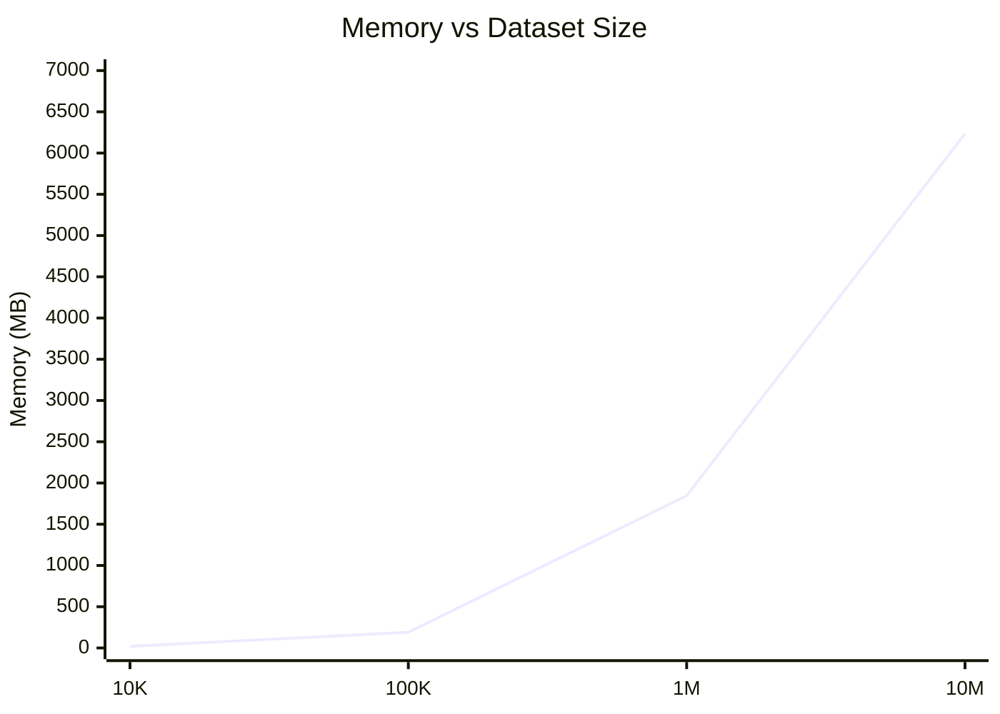

# Pipeline Library Architecture Report

## Overview

This toy pipeline library is built like Lego blocks - simple, composable pieces that snap together. The core design uses functional composition with Go's channels for streaming data processing. Each stage operates independently in its own goroutine, connected by buffered channels. The library leverages Go's type system with generics to ensure compile-time safety while maintaining flexibility across different data types, making it both performant and developer-friendly.

## Architecture Diagram

### Core Components



### Data Flow



### Parallel Processing Flow



## Data Structures Used and Reasoning

### Stage Interface

```go
type Stage[I, O any] func(<-chan I) <-chan O
```

**Reasoning:**

- **Function type over interface**: Enables natural composition and reduces allocation overhead
- **Generic parameters**: Provides type safety while maintaining flexibility across different data types
- **Channel-based**: Leverages Go channels for built-in backpressure and goroutine coordination
- **Pointer semantics**: All stages use `*T` to avoid copying large structures through the pipeline

### Channel Network

```go
out := make(chan *T, ChannelBufSize)
```

**Reasoning:**

- **Buffered channels**: Prevent blocking when stages process at different speeds
- **Configurable buffer sizes**: Allow tuning for different workload characteristics
- **Pointer flow**: Only pointers move through channels, not the actual data structures
- **Natural backpressure**: Channels automatically handle flow control between stages

### Configuration Structure

```go
var (
    NumWorkers     = getEnvAsIntOnly("PIPELINE_NUM_WORKERS", 4)
    BatchSize      = getEnvAsIntOnly("PIPELINE_BATCH_SIZE", 100)
    ChannelBufSize = getEnvAsIntOnly("PIPELINE_CHANNEL_BUF_SIZE", 10)
)
```

**Reasoning:**

- **Environment-based**: Allows runtime configuration without recompilation
- **Sensible defaults**: Provides good performance out of the box
- **Production-ready**: Essential for deployment in different environments

## Algorithms Used and Reasoning

### Fan-Out/Fan-In Pattern

```go
func FanOutStage[I, O any](numWorkers int, worker Stage[I, O]) Stage[I, O]
```

**Algorithm:**

1. Round-robin distribution of input events across worker channels
2. Independent parallel processing in separate goroutines
3. Result collection and merging back to single output stream
4. Proper synchronization with WaitGroup for cleanup

**Reasoning:**

- **Horizontal scaling**: Utilizes multiple CPU cores for processing
- **Load balancing**: Round-robin ensures even work distribution
- **Fault isolation**: Worker failures don't affect other workers
- **Resource efficiency**: Workers can process at their own pace

### Batching Algorithm

```go
func BatchStage[T any](batchSize int) Stage[*T, []*T]
```

**Algorithm:**

1. Accumulate events into slices until batch size is reached
2. Emit complete batches downstream
3. Handle remainder by emitting partial batch when input closes

**Reasoning:**

- **Throughput optimization**: Reduces per-event processing overhead
- **Memory locality**: Batch processing improves cache performance
- **Amortized costs**: Function call overhead spread across multiple events

## Interface Design and Reasoning

### Functional Composition Approach

```go
pipeline := Chain(
    MapStage(transform),
    FilterStage(predicate),
    ReduceStage(convert),
)
```

**Design Principles:**

- **Immutability**: Stages don't modify input data structures directly
- **Composability**: Stages can be combined in any order that respects type constraints
- **Reusability**: Individual stages can be reused across different pipelines

### Type Safety with Generics

```go
func Chain[I, M, O any](s1 Stage[I, M], s2 Stage[M, O]) Stage[I, O]
```

**Reasoning:**

- **Compile-time verification**: Generic constraints ensure type compatibility between stages
- **Runtime safety**: Eliminates type assertion errors and runtime type checking overhead
- **Developer experience**: Clear error messages for type mismatches during development

### Stage-Specific Interfaces

**MapStage:**

```go
func MapStage[T any](f func(*T) *T) Stage[*T, *T]
```

- Transforms events by applying a function to each one
- Uses pointers to avoid copying large structures
- Allows in-place modification for efficiency

**FilterStage:**

```go
func FilterStage[T any](f func(*T) bool) Stage[*T, *T]
```

- Filters events based on a boolean predicate function
- Simple predicate function interface
- Zero-copy for events that pass the filter

**ReduceStage:**

```go
func ReduceStage[T, R any](f func(*T) *R) Stage[*T, *R]
```

- Transforms events from one type to another
- Enables type conversion within pipelines
- Maintains pointer efficiency for large structures

**GenerateStage:**

```go
func GenerateStage[T any](f func(*T) []*T) Stage[*T, *T]
```

- Expands single events into multiple events
- Useful for data enrichment and event multiplication
- Handles dynamic output generation

**IfStage:**

```go
func IfStage[T, U any](cond func(*T) bool, thenStage, elseStage Stage[*T, *U]) Stage[*T, *U]
```

- Provides conditional routing based on predicates
- Routes events to different processing branches
- Enables complex decision trees in pipelines

**FanOutStage:**

```go
func FanOutStage[I, O any](numWorkers int, worker Stage[I, O]) Stage[I, O]
```

- Distributes work across multiple worker goroutines
- Implements round-robin load balancing
- Provides horizontal scaling for CPU-intensive operations

**BatchStage:**

```go
func BatchStage[T any](batchSize int) Stage[*T, []*T]
```

- Groups individual events into batches
- Optimizes throughput by reducing per-event overhead
- Configurable batch size for different workload characteristics

**FlattenStage:**

```go
func FlattenStage[T any]() Stage[[]*T, *T]
```

- Converts batches back to individual events
- Complements BatchStage for batch processing workflows
- Maintains event ordering within batches

**ForEachStage:**

```go
func ForEachStage[T, R any](processor Stage[*T, *R]) Stage[[]*T, []*R]
```

- Applies processing to each event within a batch
- Enables parallel processing within batch boundaries
- Maintains batch structure while transforming contents

**ParallelPipeline:**

```go
func ParallelPipeline[T, R any](processor Stage[*T, *R], numWorkers, batchSize int) Stage[*T, *R]
```

- High-level parallel processing abstraction combining multiple stages
- Combines batching, fan-out, and flattening into one convenient interface
- Configurable worker count and batch size for different workloads

**MetricStage:**

```go
func MetricStage[I, O any](name string, inner Stage[I, O]) Stage[I, O]
```

- Wraps any stage to collect performance metrics
- Uses decorator pattern to wrap any existing stage
- Integrates with ClickHouse for time-series storage and Grafana for visualization

## Areas for Improvement/Optimization

### Performance Analysis Results

Benchmarking with sample Mable event data at different scales, the following performance metrics were observed:

<div style="display: flex; justify-content: space-between;">

<div style="width: 30%;">

**A. Runtime Performance**



</div>

<div style="width: 30%;">

**B. Throughput Analysis**



</div>

<div style="width: 30%;">

**C. Memory Usage**



</div>

</div>

### Areas Identified for Improvement

Based on the performance analysis, several areas show potential for optimization:

1. **Large dataset performance**: Pipeline doesn't scale well beyond 1M events - runtime jumps from 1.08s to 18.0s
2. **Memory efficiency**: 6GB+ memory usage for 10M events indicates excessive allocation
3. **Throughput plateau**: Peak performance at medium scale (100K events) suggests architectural bottlenecks
4. **Memory allocation patterns**: Linear memory growth with acceleration at largest scale
5. **Worker utilization**: Current fixed worker count may not be optimal for all dataset sizes
6. **Batch processing efficiency**: Current batching strategy may not adapt well to different data characteristics

## Additional Notes

### Dynamic Hyperparameter Tuning

I explored making the pipeline hyperparameters dynamic and self-tuning based on runtime conditions, but found it challenging to implement effectively. The current static configuration approach provides predictable behavior, though it requires manual tuning for different workloads. I believe that woulld be more practical for production use cases.

### Go 1.25 Experimental Garbage Collector

The implementation uses Go 1.25's experimental "greentea" garbage collector which is designed for lower latency applications. However I could not definitively measure its impact on this pipeline's performance, likely due to suboptimal memory allocation patterns.

## Conclusion

The pipeline library successfully implements the Lego philosophy - simple, composable pieces that build complex data processing systems. The functional design with Go's channels creates natural, scalable processing with good type safety and performance characteristics up to medium scale. The identified optimization opportunities provide clear paths for enhancing performance at larger scales while maintaining the core design principles.
